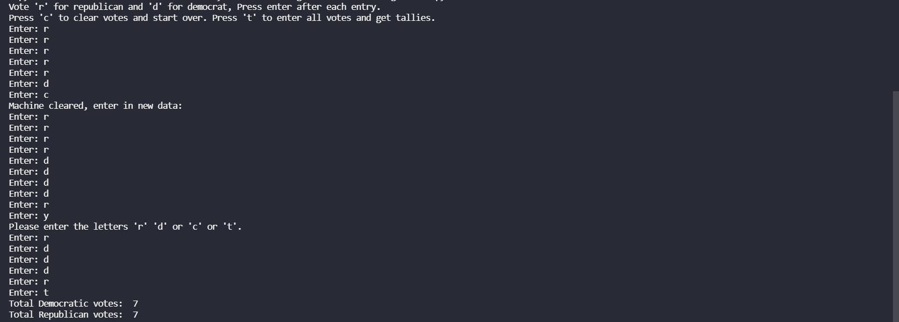

# Voting-Machine
Python CLI Voting Machine

This Python program implements a VotingMachine class that can be used for a simple election. Methods clear the machine state, vote for a Democrat, vote for a Republican, and get the tallies for both parties. A testVotingMachine file with at main() will use this class VotingMachine and will print out the results.

## Screenshots 

